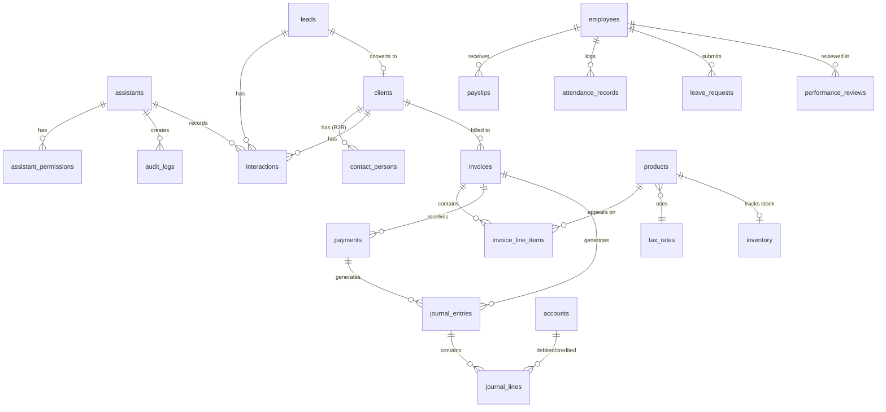

# Technical Architecture & Implementation Plan: Syllabux API-Only ERP

This document outlines the technical architecture and step-by-step implementation plan for the Syllabux API-Only ERP system managed by CLI AI assistants.

## 1. Technology Stack

| Layer | Choice | Rationale |
|---|---|---|
| Runtime | Node.js | Async I/O, large ecosystem |
| Language | TypeScript | Type safety, Zod integration, auto-generated OpenAPI |
| Framework | Express.js | Mature, well-understood, extensive middleware ecosystem |
| Database Driver | `better-sqlite3` | Synchronous API (no callback complexity), high performance |
| Validation | `zod` | Runtime validation + static types + OpenAPI schema generation from one source |
| OpenAPI | `@asteasolutions/zod-to-openapi` + `swagger-ui-express` | Spec is always in sync with validation rules |
| Search | SQLite FTS5 | Built-in, no external dependencies |
| Logging | `pino` | Structured JSON logging, fast, low overhead |
| Testing | `jest` + `supertest` | Industry standard for Express API testing |
| Process Manager | `tsx` (dev), `node` (prod) | Direct TypeScript execution in dev, compiled JS in prod |

## 2. Project Directory Structure

```
erp/
├── docs/
│   ├── ERP-BRD.md
│   └── ERP-Architecture-Plan.md
├── src/
│   ├── app.ts                    # Express app bootstrap, middleware registration
│   ├── server.ts                 # HTTP server entry point
│   ├── config/
│   │   ├── database.ts           # SQLite connection, PRAGMAs, singleton
│   │   └── env.ts                # Environment variable loading & validation
│   ├── middleware/
│   │   ├── auth.ts               # API key validation
│   │   ├── rbac.ts               # Permission checking
│   │   ├── audit.ts              # Before/after state capture & logging
│   │   ├── idempotency.ts        # Idempotency-Key header handling
│   │   ├── rateLimiter.ts        # Per-assistant rate limiting (SQLite store)
│   │   ├── errorHandler.ts       # Global error handler
│   │   ├── pagination.ts         # Cursor-based pagination parser
│   │   └── requestLogger.ts      # Structured request/response logging (pino)
│   ├── shared/
│   │   ├── errors.ts             # AppError class hierarchy
│   │   ├── responses.ts          # Standardised success/error response builders
│   │   ├── eventBus.ts           # Internal event emitter + DB persistence
│   │   ├── pagination.ts         # Cursor encoding/decoding utilities
│   │   └── openapi.ts            # OpenAPI registry & document generator
│   ├── modules/
│   │   ├── assistants/           # Assistant management & bootstrap
│   │   │   ├── assistants.routes.ts
│   │   │   ├── assistants.controller.ts
│   │   │   ├── assistants.service.ts
│   │   │   ├── assistants.queries.ts
│   │   │   └── assistants.schemas.ts
│   │   ├── crm/
│   │   │   ├── leads/
│   │   │   │   ├── leads.routes.ts
│   │   │   │   ├── leads.controller.ts
│   │   │   │   ├── leads.service.ts
│   │   │   │   ├── leads.queries.ts
│   │   │   │   └── leads.schemas.ts
│   │   │   ├── clients/          # Same pattern as leads
│   │   │   ├── contacts/
│   │   │   ├── interactions/
│   │   │   └── scheduling/
│   │   ├── catalog/
│   │   │   ├── products/
│   │   │   └── taxRates/
│   │   ├── invoicing/
│   │   │   ├── invoices/
│   │   │   └── payments/
│   │   ├── accounting/
│   │   │   ├── accounts/
│   │   │   ├── journalEntries/
│   │   │   └── reports/
│   │   ├── inventory/
│   │   │   ├── stock/
│   │   │   ├── purchaseOrders/
│   │   │   └── suppliers/
│   │   └── hr/
│   │       ├── employees/
│   │       ├── payroll/
│   │       ├── attendance/
│   │       ├── leave/
│   │       └── performance/
│   └── migrations/
│       ├── runner.ts             # Migration execution engine
│       ├── 001_foundation.sql
│       ├── 002_crm.sql
│       ├── 003_catalog.sql
│       ├── 004_invoicing.sql
│       ├── 005_accounting.sql
│       ├── 006_inventory.sql
│       └── 007_hr.sql
├── scripts/
│   ├── seed.ts                   # Bootstrap first admin assistant
│   └── backup.ts                 # WAL-safe database backup script
├── tests/
│   ├── setup.ts                  # Test DB factory (in-memory SQLite)
│   ├── middleware/
│   └── modules/
├── package.json
├── tsconfig.json
├── .env.example
└── .gitignore
```

### Module File Convention

Every module follows a consistent 5-file pattern:

| File | Responsibility |
|---|---|
| `*.routes.ts` | Express router definition, middleware binding, Zod schema references |
| `*.controller.ts` | Request parsing, response formatting — no business logic |
| `*.service.ts` | Business logic, validation rules, event emission |
| `*.queries.ts` | Raw SQL queries via `better-sqlite3` prepared statements |
| `*.schemas.ts` | Zod schemas (input, output, params) registered with OpenAPI |

## 3. System Components

### 3.1 Database Design (SQLite)

#### Connection Configuration

```typescript
// src/config/database.ts
import Database from 'better-sqlite3';

const db = new Database('./data/erp.db');
db.pragma('journal_mode = WAL');
db.pragma('busy_timeout = 5000');
db.pragma('foreign_keys = ON');
db.pragma('synchronous = NORMAL');  // Safe with WAL, better write performance

export { db };
```

#### Transaction Utility

All multi-step mutations (especially accounting operations) must be wrapped in a transaction. If any step fails, the entire operation rolls back.

```typescript
// src/config/database.ts (continued)

export function withTransaction<T>(fn: () => T): T {
  const transaction = db.transaction(fn);
  return transaction();
}
```

**Usage example** (creating an invoice + its journal entry atomically):
```typescript
withTransaction(() => {
  const invoice = insertInvoice(invoiceData);
  createJournalEntry(invoice.id, invoice.totalAmount, 'accounts_receivable', 'revenue');
  eventBus.publish('invoice.sent', 'invoicing', 'invoices', invoice.id, invoice);
});
// If the journal entry fails, the invoice insert is also rolled back.
```

#### Soft Delete Strategy

Not all tables use soft delete. The strategy is scoped based on referential integrity needs:

| Strategy | Tables | Rationale |
|---|---|---|
| **Soft delete** (`deleted_at TEXT`) | `clients`, `employees`, `products`, `suppliers` | Referenced by invoices, journal entries, and payslips — hard delete would break FK integrity or orphan financial records |
| **Immutable** (never deleted) | `audit_logs`, `journal_entries`, `journal_lines`, `events` | Append-only by design — corrections via reversing entries |
| **Hard delete** | `leads` (pre-conversion), `scheduled_events`, `draft invoices`, `idempotency_keys` (TTL-based cleanup) | No downstream references or ephemeral by nature |

Soft-deleted records:
- Have a `deleted_at TEXT` column (null = active, timestamp = deleted)
- Are excluded from all list queries by default (`WHERE deleted_at IS NULL`)
- Can be included via `?include_deleted=true` query parameter (requires `read:deleted` permission)
- Are never physically removed from the database

**Unique constraint handling:** Any `UNIQUE` constraint on a soft-deletable table must use a partial index scoped to active records. This prevents soft-deleted records from blocking creation of new records with the same unique value:

```sql
-- Instead of: CREATE UNIQUE INDEX idx_clients_email ON clients(email);
-- Use a partial index that only applies to active (non-deleted) records:
CREATE UNIQUE INDEX idx_clients_email_active ON clients(email) WHERE deleted_at IS NULL;
CREATE UNIQUE INDEX idx_products_sku_active ON products(sku) WHERE deleted_at IS NULL;
```

#### Foundation Schema (DDL)

```sql
-- 001_foundation.sql

-- Tracks which migrations have been applied
CREATE TABLE IF NOT EXISTS migrations (
    id INTEGER PRIMARY KEY AUTOINCREMENT,
    name TEXT NOT NULL UNIQUE,
    applied_at TEXT NOT NULL DEFAULT (datetime('now'))
);

-- Polymorphic file attachments
CREATE TABLE documents (
    id TEXT PRIMARY KEY,               -- UUID
    resource_type TEXT NOT NULL,       -- e.g., 'clients', 'invoices'
    resource_id TEXT NOT NULL,         -- UUID of the specific record
    file_url TEXT NOT NULL,            -- Storage path or cloud URL
    file_name TEXT NOT NULL,
    mime_type TEXT NOT NULL,
    size_bytes INTEGER NOT NULL,
    uploaded_by TEXT NOT NULL REFERENCES assistants(id),
    created_at TEXT NOT NULL DEFAULT (datetime('now'))
);
CREATE INDEX idx_documents_resource ON documents(resource_type, resource_id);

-- CLI AI assistant identities
-- NOTE: api_key_hash stores SHA-256 hash of the API key, never the plaintext.
-- The raw key is shown once at creation time and never stored.
CREATE TABLE assistants (
    id TEXT PRIMARY KEY,               -- UUID
    name TEXT NOT NULL,
    api_key_hash TEXT NOT NULL UNIQUE,  -- SHA-256 hash of the API key
    api_key_prefix TEXT NOT NULL,       -- First 8 chars of key (for identification, e.g., 'erp_a1b2')
    rate_limit_per_minute INTEGER NOT NULL DEFAULT 60,
    is_admin INTEGER NOT NULL DEFAULT 0,
    status TEXT NOT NULL DEFAULT 'active' CHECK (status IN ('active', 'suspended', 'revoked')),
    created_at TEXT NOT NULL DEFAULT (datetime('now')),
    updated_at TEXT NOT NULL DEFAULT (datetime('now'))
);
CREATE INDEX idx_assistants_api_key_hash ON assistants(api_key_hash);

-- Granular permissions per assistant
CREATE TABLE assistant_permissions (
    id TEXT PRIMARY KEY,               -- UUID
    assistant_id TEXT NOT NULL REFERENCES assistants(id) ON DELETE CASCADE,
    permission TEXT NOT NULL,          -- e.g., 'read:invoices', 'write:clients', 'process:payroll'
    created_at TEXT NOT NULL DEFAULT (datetime('now')),
    UNIQUE(assistant_id, permission)
);
CREATE INDEX idx_perms_assistant ON assistant_permissions(assistant_id);

-- Optional row-level scoping (Phase 5)
CREATE TABLE assistant_scopes (
    id TEXT PRIMARY KEY,
    assistant_id TEXT NOT NULL REFERENCES assistants(id) ON DELETE CASCADE,
    resource_type TEXT NOT NULL,       -- e.g., 'clients', 'invoices'
    resource_id TEXT NOT NULL,         -- UUID of the specific record
    created_at TEXT NOT NULL DEFAULT (datetime('now')),
    UNIQUE(assistant_id, resource_type, resource_id)
);

-- Append-only audit trail
CREATE TABLE audit_logs (
    id TEXT PRIMARY KEY,               -- UUID
    assistant_id TEXT NOT NULL REFERENCES assistants(id),
    action TEXT NOT NULL,              -- 'CREATE', 'UPDATE', 'DELETE'
    resource_type TEXT NOT NULL,
    resource_id TEXT NOT NULL,
    before_state TEXT,                 -- JSON (null for CREATE)
    after_state TEXT,                  -- JSON (null for DELETE)
    idempotency_key TEXT,
    ip_address TEXT,
    timestamp TEXT NOT NULL DEFAULT (datetime('now'))
);
CREATE INDEX idx_audit_resource ON audit_logs(resource_type, resource_id);
CREATE INDEX idx_audit_assistant ON audit_logs(assistant_id);
CREATE INDEX idx_audit_timestamp ON audit_logs(timestamp);

-- Idempotency cache
CREATE TABLE idempotency_keys (
    key TEXT PRIMARY KEY,
    assistant_id TEXT NOT NULL REFERENCES assistants(id),
    request_method TEXT NOT NULL,
    request_path TEXT NOT NULL,
    response_status INTEGER NOT NULL,
    response_body TEXT NOT NULL,        -- JSON
    created_at TEXT NOT NULL DEFAULT (datetime('now'))
);

-- Internal event bus (persistent store)
CREATE TABLE events (
    id TEXT PRIMARY KEY,               -- UUID
    event_type TEXT NOT NULL,          -- e.g., 'invoice.sent', 'payment.received'
    source_module TEXT NOT NULL,       -- e.g., 'invoicing', 'hr'
    resource_type TEXT NOT NULL,
    resource_id TEXT NOT NULL,
    payload TEXT NOT NULL,             -- JSON
    status TEXT NOT NULL DEFAULT 'pending' CHECK (status IN ('pending', 'completed', 'failed')),
    error_message TEXT,
    created_at TEXT NOT NULL DEFAULT (datetime('now'))
);
CREATE INDEX idx_events_type ON events(event_type);
CREATE INDEX idx_events_unprocessed ON events(status, created_at);
```

```sql
-- 002_crm.sql

CREATE TABLE leads (
    id TEXT PRIMARY KEY,
    source TEXT,                        -- e.g., 'website', 'referral', 'cold_call'
    first_name TEXT NOT NULL,
    last_name TEXT NOT NULL,
    email TEXT,
    phone TEXT,
    company_name TEXT,
    stage TEXT NOT NULL DEFAULT 'new' CHECK (stage IN ('new', 'qualified', 'proposal', 'negotiation', 'won', 'lost')),
    assigned_assistant_id TEXT REFERENCES assistants(id),
    notes TEXT,
    converted_client_id TEXT,          -- Set when lead is converted
    created_at TEXT NOT NULL DEFAULT (datetime('now')),
    updated_at TEXT NOT NULL DEFAULT (datetime('now'))
);
CREATE VIRTUAL TABLE leads_fts USING fts5(first_name, last_name, email, company_name, notes, content=leads, content_rowid=rowid);

-- Triggers to keep leads_fts synchronized
CREATE TRIGGER leads_ai AFTER INSERT ON leads BEGIN
  INSERT INTO leads_fts(rowid, first_name, last_name, email, company_name, notes) 
  VALUES (new.rowid, new.first_name, new.last_name, new.email, new.company_name, new.notes);
END;
CREATE TRIGGER leads_ad AFTER DELETE ON leads BEGIN
  INSERT INTO leads_fts(leads_fts, rowid, first_name, last_name, email, company_name, notes) 
  VALUES ('delete', old.rowid, old.first_name, old.last_name, old.email, old.company_name, old.notes);
END;
CREATE TRIGGER leads_au AFTER UPDATE ON leads BEGIN
  INSERT INTO leads_fts(leads_fts, rowid, first_name, last_name, email, company_name, notes) 
  VALUES ('delete', old.rowid, old.first_name, old.last_name, old.email, old.company_name, old.notes);
  INSERT INTO leads_fts(rowid, first_name, last_name, email, company_name, notes) 
  VALUES (new.rowid, new.first_name, new.last_name, new.email, new.company_name, new.notes);
END;

CREATE TABLE clients (
    id TEXT PRIMARY KEY,
    type TEXT NOT NULL CHECK (type IN ('b2c', 'b2b')),
    name TEXT NOT NULL,                -- Individual name or company name
    email TEXT,
    phone TEXT,
    address TEXT,
    status TEXT NOT NULL DEFAULT 'active' CHECK (status IN ('active', 'inactive', 'suspended', 'churned')),
    lead_id TEXT REFERENCES leads(id), -- Original lead (for attribution)
    currency TEXT NOT NULL DEFAULT 'USD',
    deleted_at TEXT,                    -- Soft delete (null = active)
    created_at TEXT NOT NULL DEFAULT (datetime('now')),
    updated_at TEXT NOT NULL DEFAULT (datetime('now'))
);
CREATE VIRTUAL TABLE clients_fts USING fts5(name, email, phone, address, content=clients, content_rowid=rowid);

-- Triggers to keep clients_fts synchronized
CREATE TRIGGER clients_ai AFTER INSERT ON clients BEGIN
  INSERT INTO clients_fts(rowid, name, email, phone, address) 
  VALUES (new.rowid, new.name, new.email, new.phone, new.address);
END;
CREATE TRIGGER clients_ad AFTER DELETE ON clients BEGIN
  INSERT INTO clients_fts(clients_fts, rowid, name, email, phone, address) 
  VALUES ('delete', old.rowid, old.name, old.email, old.phone, old.address);
END;
CREATE TRIGGER clients_au AFTER UPDATE ON clients BEGIN
  INSERT INTO clients_fts(clients_fts, rowid, name, email, phone, address) 
  VALUES ('delete', old.rowid, old.name, old.email, old.phone, old.address);
  INSERT INTO clients_fts(rowid, name, email, phone, address) 
  VALUES (new.rowid, new.name, new.email, new.phone, new.address);
END;

CREATE TABLE contact_persons (
    id TEXT PRIMARY KEY,
    client_id TEXT NOT NULL REFERENCES clients(id) ON DELETE CASCADE,
    first_name TEXT NOT NULL,
    last_name TEXT NOT NULL,
    email TEXT,
    phone TEXT,
    role TEXT,                          -- e.g., 'CEO', 'Procurement Manager'
    is_primary INTEGER NOT NULL DEFAULT 0,
    created_at TEXT NOT NULL DEFAULT (datetime('now'))
);

CREATE TABLE interactions (
    id TEXT PRIMARY KEY,
    lead_id TEXT REFERENCES leads(id),
    client_id TEXT REFERENCES clients(id),
    type TEXT NOT NULL CHECK (type IN ('call', 'email', 'meeting', 'note', 'other')),
    subject TEXT,
    body TEXT,
    interaction_date TEXT NOT NULL DEFAULT (datetime('now')),
    assistant_id TEXT NOT NULL REFERENCES assistants(id),
    created_at TEXT NOT NULL DEFAULT (datetime('now')),
    CHECK (lead_id IS NOT NULL OR client_id IS NOT NULL)  -- Must link to at least one
);

CREATE TABLE scheduled_events (
    id TEXT PRIMARY KEY,
    title TEXT NOT NULL,
    description TEXT,
    event_type TEXT NOT NULL CHECK (event_type IN ('meeting', 'call', 'task', 'reminder', 'other')),
    start_time TEXT NOT NULL,
    end_time TEXT,
    lead_id TEXT REFERENCES leads(id),
    client_id TEXT REFERENCES clients(id),
    employee_id TEXT,                  -- FK added in HR migration
    assistant_id TEXT NOT NULL REFERENCES assistants(id),
    status TEXT NOT NULL DEFAULT 'scheduled' CHECK (status IN ('scheduled', 'completed', 'cancelled')),
    created_at TEXT NOT NULL DEFAULT (datetime('now')),
    updated_at TEXT NOT NULL DEFAULT (datetime('now'))
);
```

```sql
-- 003_catalog.sql

CREATE TABLE products (
    id TEXT PRIMARY KEY,
    sku TEXT UNIQUE,
    name TEXT NOT NULL,
    description TEXT,
    type TEXT NOT NULL CHECK (type IN ('subscription', 'one_time_service', 'one_time_product')),
    default_price REAL NOT NULL,
    currency TEXT NOT NULL DEFAULT 'USD',
    billing_interval TEXT CHECK (
        (type = 'subscription' AND billing_interval IN ('monthly', 'quarterly', 'annually'))
        OR (type != 'subscription' AND billing_interval IS NULL)
    ),
    tax_rate_id TEXT REFERENCES tax_rates(id),
    is_active INTEGER NOT NULL DEFAULT 1,
    requires_stock INTEGER NOT NULL DEFAULT 0,  -- true for one_time_product
    deleted_at TEXT,                    -- Soft delete (null = active)
    created_at TEXT NOT NULL DEFAULT (datetime('now')),
    updated_at TEXT NOT NULL DEFAULT (datetime('now'))
);
CREATE VIRTUAL TABLE products_fts USING fts5(name, description, content=products, content_rowid=rowid);

-- Triggers to keep products_fts synchronized
CREATE TRIGGER products_ai AFTER INSERT ON products BEGIN
  INSERT INTO products_fts(rowid, name, description) 
  VALUES (new.rowid, new.name, new.description);
END;
CREATE TRIGGER products_ad AFTER DELETE ON products BEGIN
  INSERT INTO products_fts(products_fts, rowid, name, description) 
  VALUES ('delete', old.rowid, old.name, old.description);
END;
CREATE TRIGGER products_au AFTER UPDATE ON products BEGIN
  INSERT INTO products_fts(products_fts, rowid, name, description) 
  VALUES ('delete', old.rowid, old.name, old.description);
  INSERT INTO products_fts(rowid, name, description) 
  VALUES (new.rowid, new.name, new.description);
END;

CREATE TABLE tax_rates (
    id TEXT PRIMARY KEY,
    name TEXT NOT NULL,                -- e.g., 'Standard VAT', 'Zero-Rated'
    rate REAL NOT NULL,                -- e.g., 0.20 for 20%
    is_default INTEGER NOT NULL DEFAULT 0,
    created_at TEXT NOT NULL DEFAULT (datetime('now'))
);

CREATE TABLE exchange_rates (
    id TEXT PRIMARY KEY,
    from_currency TEXT NOT NULL,
    to_currency TEXT NOT NULL,
    rate REAL NOT NULL,
    effective_date TEXT NOT NULL,
    created_at TEXT NOT NULL DEFAULT (datetime('now')),
    UNIQUE(from_currency, to_currency, effective_date)
);
```

#### Entity Relationship Overview



### 3.2 Error Handling Architecture

```typescript
// src/shared/errors.ts

export class AppError extends Error {
  constructor(
    public statusCode: number,
    public code: string,
    message: string,
    public details?: Record<string, unknown>
  ) {
    super(message);
    this.name = 'AppError';
  }
}

// Specific error subclasses
export class NotFoundError extends AppError {
  constructor(resource: string, id: string) {
    super(404, 'NOT_FOUND', `${resource} with id '${id}' not found`);
  }
}

export class ValidationError extends AppError {
  constructor(details: Record<string, unknown>) {
    super(422, 'VALIDATION_ERROR', 'Request validation failed', details);
  }
}

export class ForbiddenError extends AppError {
  constructor(permission: string) {
    super(403, 'FORBIDDEN', `Missing required permission: ${permission}`);
  }
}

export class ConflictError extends AppError {
  constructor(message: string, details?: Record<string, unknown>) {
    super(409, 'CONFLICT', message, details);
  }
}

export class RateLimitError extends AppError {
  constructor(retryAfter: number) {
    super(429, 'RATE_LIMITED', 'Too many requests', { retry_after: retryAfter });
  }
}
```

```typescript
// src/middleware/errorHandler.ts

export function errorHandler(err: Error, req: Request, res: Response, next: NextFunction) {
  if (err instanceof AppError) {
    return res.status(err.statusCode).json({
      error: {
        code: err.code,
        message: err.message,
        details: err.details ?? null
      }
    });
  }

  // Zod validation errors
  if (err instanceof ZodError) {
    return res.status(422).json({
      error: {
        code: 'VALIDATION_ERROR',
        message: 'Request validation failed',
        details: err.errors.map(e => ({ path: e.path.join('.'), message: e.message }))
      }
    });
  }

  // Unexpected errors
  logger.error({ err, reqId: req.id }, 'Unhandled error');
  return res.status(500).json({
    error: { code: 'INTERNAL_ERROR', message: 'An unexpected error occurred', details: null }
  });
}
```

### 3.3 Audit Middleware: Before/After State Capture

The audit middleware uses a **wrapper pattern** — it hooks into the response lifecycle to capture state:

```typescript
// src/middleware/audit.ts

export function audit(resourceType: string) {
  return async (req: Request, res: Response, next: NextFunction) => {
    // Only audit mutating requests
    if (!['POST', 'PUT', 'PATCH', 'DELETE'].includes(req.method)) return next();

    const resourceId = req.params.id;
    let beforeState: object | null = null;

    // For UPDATE/DELETE, capture the current state BEFORE the handler runs
    if (resourceId && ['PUT', 'PATCH', 'DELETE'].includes(req.method)) {
      beforeState = getResourceById(db, resourceType, resourceId);
    }

    // Intercept res.json() to capture the after-state
    const originalJson = res.json.bind(res);
    res.json = (body: any) => {
      // Only log successful mutations (2xx)
      if (res.statusCode >= 200 && res.statusCode < 300) {
        const action = req.method === 'POST' ? 'CREATE'
                     : req.method === 'DELETE' ? 'DELETE'
                     : 'UPDATE';

        db.prepare(`
          INSERT INTO audit_logs (id, assistant_id, action, resource_type, resource_id,
                                  before_state, after_state, idempotency_key, timestamp)
          VALUES (?, ?, ?, ?, ?, ?, ?, ?, datetime('now'))
        `).run(
          uuid(), req.assistant.id, action, resourceType,
          resourceId ?? body?.data?.id ?? null,
          beforeState ? JSON.stringify(beforeState) : null,
          req.method !== 'DELETE' ? JSON.stringify(body?.data ?? body) : null,
          req.headers['idempotency-key'] ?? null
        );
      }
      return originalJson(body);
    };

    next();
  };
}
```

### 3.4 Internal Event Bus

The event bus is implemented in **Phase 1** as core infrastructure, since Phase 2 (accounting) depends on it for automated journal generation.

```typescript
// src/shared/eventBus.ts
import { EventEmitter } from 'events';
import { v4 as uuid } from 'uuid';
import { db } from '../config/database';
import { logger } from '../config/logger';

class EventBus extends EventEmitter {
  /**
   * Emit an event, persist it to the events table, and notify listeners.
   * The listener is responsible for marking the event as processed.
   */
  publish(eventType: string, sourceModule: string, resourceType: string,
          resourceId: string, payload: object) {
    const eventId = uuid();

    // Persist to DB for querying and replay
    db.prepare(`
      INSERT INTO events (id, event_type, source_module, resource_type,
                          resource_id, payload, created_at)
      VALUES (?, ?, ?, ?, ?, ?, datetime('now'))
    `).run(eventId, eventType, sourceModule, resourceType, resourceId,
           JSON.stringify(payload));

    // Emit to in-process listeners (e.g., accounting module)
    this.emit(eventType, { eventId, resourceType, resourceId, payload });
  }

  /**
   * Mark an event as completed.
   */
  markCompleted(eventId: string) {
    db.prepare("UPDATE events SET status = 'completed' WHERE id = ?").run(eventId);
  }

  /**
   * Mark an event as failed and record the error.
   */
  markFailed(eventId: string, error: Error) {
    db.prepare("UPDATE events SET status = 'failed', error_message = ? WHERE id = ?").run(error.message, eventId);
  }

  /**
   * Recovery: called on application startup.
   * Re-emits any events that were persisted but never completed
   * (e.g., due to a crash between DB insert and listener completion).
   */
  replayUnprocessed() {
    const unprocessed = db.prepare(
      "SELECT * FROM events WHERE status = 'pending' ORDER BY created_at ASC"
    ).all();

    if (unprocessed.length > 0) {
      logger.info(`Replaying ${unprocessed.length} unprocessed events`);
    }

    for (const event of unprocessed) {
      this.emit(event.event_type, {
        eventId: event.id,
        resourceType: event.resource_type,
        resourceId: event.resource_id,
        payload: JSON.parse(event.payload),
      });
    }
  }
}

export const eventBus = new EventBus();
```

**Startup integration:**
```typescript
// src/app.ts (after all listeners are registered)
import { eventBus } from './shared/eventBus';

// Register all event listeners first
import './modules/accounting/journalEntries/journalEntries.listener';

// Then replay any events that were missed due to a prior crash
eventBus.replayUnprocessed();
```

**Usage in Phase 2 (Accounting auto-journals):**
```typescript
// src/modules/accounting/journalEntries/journalEntries.listener.ts
import { eventBus } from '../../../shared/eventBus';

eventBus.on('invoice.sent', async ({ eventId, resourceId, payload }) => {
  try {
    // Auto-generate: Debit Accounts Receivable, Credit Revenue
    await createJournalEntry(payload.invoiceId, payload.totalAmount, ...);
    eventBus.markCompleted(eventId);
  } catch (err) {
    eventBus.markFailed(eventId, err);
  }
});

eventBus.on('payment.received', async ({ eventId, resourceId, payload }) => {
  try {
    // Auto-generate: Debit Cash/Bank, Credit Accounts Receivable
    await createJournalEntry(payload.paymentId, payload.amount, ...);
    eventBus.markCompleted(eventId);
  } catch (err) {
    eventBus.markFailed(eventId, err);
  }
});
```

### 3.5 Bootstrap / Seed Strategy

The first admin assistant cannot be created via the API (chicken-and-egg problem). A CLI seed script handles this:

```typescript
// scripts/seed.ts
import { db } from '../src/config/database';
import { v4 as uuid } from 'uuid';
import crypto from 'crypto';

const adminId = uuid();
const apiKey = `erp_${crypto.randomBytes(32).toString('hex')}`;
const apiKeyHash = crypto.createHash('sha256').update(apiKey).digest('hex');
const apiKeyPrefix = apiKey.substring(0, 8);

db.prepare(`
  INSERT INTO assistants (id, name, api_key_hash, api_key_prefix, is_admin, status)
  VALUES (?, 'System Admin', ?, ?, 1, 'active')
`).run(adminId, apiKeyHash, apiKeyPrefix);

// Grant all permissions
const allPermissions = [
  'read:assistants', 'write:assistants',
  'read:leads', 'write:leads',
  'read:clients', 'write:clients',
  'read:interactions', 'write:interactions',
  'read:products', 'write:products',
  'read:invoices', 'write:invoices',
  'read:payments', 'write:payments',
  'read:accounts', 'write:accounts',
  'read:journal_entries', 'write:journal_entries',
  'read:inventory', 'write:inventory',
  'read:employees', 'write:employees',
  'process:payroll',
  'read:audit_logs',
];

const stmt = db.prepare(`
  INSERT INTO assistant_permissions (id, assistant_id, permission)
  VALUES (?, ?, ?)
`);

for (const perm of allPermissions) {
  stmt.run(uuid(), adminId, perm);
}

console.log('Admin assistant created.');
console.log(`API Key: ${apiKey}`);
console.log('Store this key securely — it will not be shown again.');
```

**Run via:** `npx tsx scripts/seed.ts`

### 3.6 Health & Monitoring

```typescript
// Mounted outside auth middleware
app.get('/health', (req, res) => {
  try {
    db.prepare('SELECT 1').get();  // Verify DB is accessible
    res.json({ status: 'healthy', timestamp: new Date().toISOString() });
  } catch {
    res.status(503).json({ status: 'unhealthy', timestamp: new Date().toISOString() });
  }
});
```

All request/response logging is handled via `pino` with structured JSON output:
```
{"level":30,"time":1717711000,"reqId":"abc-123","method":"POST","url":"/v1/clients","statusCode":201,"responseTime":12,"assistantId":"def-456"}
```

### 3.7 WAL-Safe Backup Strategy

Copying `erp.db` while the database is active in WAL mode will produce a corrupted backup unless the `-wal` and `-shm` companion files are captured in the exact same state. **Never use file-level copy tools (cp, rsync) directly on a live WAL-mode database.**

Instead, use SQLite's built-in backup API via `better-sqlite3`:

```typescript
// scripts/backup.ts
import Database from 'better-sqlite3';
import path from 'path';
import fs from 'fs';

const SOURCE_DB = './data/erp.db';
const BACKUP_DIR = './data/backups';
const timestamp = new Date().toISOString().replace(/[:.]/g, '-');
const backupPath = path.join(BACKUP_DIR, `erp-${timestamp}.db`);

fs.mkdirSync(BACKUP_DIR, { recursive: true });

const db = new Database(SOURCE_DB, { readonly: true });
db.backup(backupPath)
  .then(() => {
    console.log(`Backup created: ${backupPath}`);
    db.close();
  })
  .catch((err) => {
    console.error('Backup failed:', err);
    db.close();
    process.exit(1);
  });
```

**Run via:** `npx tsx scripts/backup.ts`

The `db.backup()` method uses SQLite's Online Backup API, which streams a consistent snapshot even while other connections are writing. The resulting backup file is a self-contained, single-file SQLite database with no `-wal` or `-shm` dependencies.

For automated daily backups, run this script via `cron`:
```
0 3 * * * cd /path/to/erp && npx tsx scripts/backup.ts
```

### 3.8 Composite Cursor Pagination

Cursor-based pagination must use a **composite cursor** encoding both `created_at` and `id` to guarantee deterministic, gap-free ordering. Relying on `created_at` alone will skip or duplicate records if multiple rows share the same timestamp (common during batch inserts).

```typescript
// src/shared/pagination.ts

/**
 * Encode a cursor from a record's created_at and id.
 * Format: base64("created_at|id")
 */
export function encodeCursor(createdAt: string, id: string): string {
  return Buffer.from(`${createdAt}|${id}`).toString('base64url');
}

/**
 * Decode a cursor back to its components.
 */
export function decodeCursor(cursor: string): { createdAt: string; id: string } {
  const decoded = Buffer.from(cursor, 'base64url').toString('utf-8');
  const [createdAt, id] = decoded.split('|');
  return { createdAt, id };
}

/**
 * Build the WHERE clause and params for cursor-based pagination.
 * Uses a composite comparison: (created_at, id) > (cursor_created_at, cursor_id)
 */
export function cursorWhereClause(cursor?: string): { clause: string; params: string[] } {
  if (!cursor) return { clause: '', params: [] };

  const { createdAt, id } = decodeCursor(cursor);
  return {
    clause: 'AND (created_at > ? OR (created_at = ? AND id > ?))',
    params: [createdAt, createdAt, id],
  };
}
```

**Usage in a query:**
```typescript
// In any *.queries.ts file
export function listClients(cursor?: string, limit = 25) {
  const { clause, params } = cursorWhereClause(cursor);

  const rows = db.prepare(`
    SELECT * FROM clients
    WHERE deleted_at IS NULL ${clause}
    ORDER BY created_at ASC, id ASC
    LIMIT ?
  `).all(...params, limit + 1);  // Fetch one extra to determine has_more

  const hasMore = rows.length > limit;
  const data = hasMore ? rows.slice(0, limit) : rows;
  const nextCursor = hasMore ? encodeCursor(data[data.length - 1].created_at, data[data.length - 1].id) : null;

  return { data, next_cursor: nextCursor, has_more: hasMore };
}
```

### 3.9 Scoped OpenAPI for AI Context Optimization

The full OpenAPI spec across all modules can reach 2000+ lines of JSON. When a CLI AI assistant loads this spec into its context window, irrelevant endpoints waste tokens and increase hallucination risk.

**Solution:** Serve a permission-filtered OpenAPI spec per assistant. When an assistant authenticates and requests the spec, the API returns only the paths and schemas that the assistant has permission to access.

```typescript
// src/shared/openapi.ts (addition)

export function getScopedSpec(permissions: string[]): OpenAPIDocument {
  const fullSpec = getFullOpenAPISpec();

  // Map permissions to path prefixes
  const allowedPrefixes = permissions.map(p => {
    const [, resource] = p.split(':');  // 'read:invoices' → 'invoices'
    return `/v1/${resource}`;
  });

  // Filter paths
  const scopedPaths: Record<string, any> = {};
  for (const [path, methods] of Object.entries(fullSpec.paths)) {
    if (allowedPrefixes.some(prefix => path.startsWith(prefix))) {
      scopedPaths[path] = methods;
    }
  }

  // Filter schemas to only those referenced by remaining paths
  const referencedSchemas = extractReferencedSchemas(scopedPaths, fullSpec.components.schemas);

  return {
    ...fullSpec,
    paths: scopedPaths,
    components: { ...fullSpec.components, schemas: referencedSchemas },
  };
}
```

**Endpoint:**
```
GET /v1/api-docs/openapi.json
```
When called with a valid API key, returns the spec scoped to that assistant's permissions. When called without authentication (or by an admin), returns the full spec.

This is scheduled for **Phase 5** (step 5.4) but the architecture accounts for it now so the OpenAPI registry is designed to support filtering from day one.

### 3.10 Accounting Safeguards

#### Lock Periods

Once a financial period is closed (e.g., month-end close), no journal entries may be created or modified within that period. This prevents retroactive changes to reported financials.

```sql
-- Part of 005_accounting.sql
CREATE TABLE closed_periods (
    id TEXT PRIMARY KEY,
    start_date TEXT NOT NULL,          -- e.g., '2026-01-01'
    end_date TEXT NOT NULL,            -- e.g., '2026-01-31'
    closed_by TEXT NOT NULL REFERENCES assistants(id),
    closed_at TEXT NOT NULL DEFAULT (datetime('now')),
    notes TEXT,
    UNIQUE(start_date, end_date)
);
```

**Enforcement** — checked before any journal entry write:
```typescript
function assertPeriodOpen(entryDate: string): void {
  const conflict = db.prepare(`
    SELECT id FROM closed_periods
    WHERE ? >= start_date AND ? <= end_date
  `).get(entryDate, entryDate);

  if (conflict) {
    throw new ConflictError(
      `Cannot create journal entry: period ${conflict.start_date} to ${conflict.end_date} is closed`
    );
  }
}
```

#### Period Closure (Overlap Prevention)

Before inserting a new closed period, application logic must verify that the new dates do not overlap with any existing locked periods. This must be done within a transaction.

```typescript
// src/modules/accounting/periods/periods.service.ts
function closePeriod(startDate: string, endDate: string, assistantId: string, notes?: string) {
  return withTransaction(() => {
    // Application-level query check for overlaps
    const overlap = db.prepare(`
      SELECT 1 FROM closed_periods
      WHERE start_date <= ? AND end_date >= ?
      LIMIT 1
    `).get(endDate, startDate);

    if (overlap) {
      throw new ConflictError('The specified date range overlaps with an already closed period.');
    }

    const id = uuid();
    db.prepare(`
      INSERT INTO closed_periods (id, start_date, end_date, closed_by, notes)
      VALUES (?, ?, ?, ?, ?)
    `).run(id, startDate, endDate, assistantId, notes || null);

    return { id, startDate, endDate };
  });
}
```

#### Journal Reversal

Journal entries are immutable — they can never be edited or deleted. To correct an error, a **reversing entry** is created that mirrors the original with debits and credits swapped.

```
POST /v1/journal-entries/:id/reverse
```

This endpoint:
1. Looks up the original journal entry and its lines
2. Asserts the current date's period is open
3. Creates a new journal entry with `reversal_of` referencing the original ID
4. Swaps all debit/credit amounts on each line
5. Returns the new reversing entry

```typescript
function reverseJournalEntry(originalId: string, assistantId: string) {
  return withTransaction(() => {
    // Prevent infinite reversals (Application-level query check)
    const alreadyReversed = db.prepare('SELECT 1 FROM journal_entries WHERE reversal_of = ?').get(originalId);
    if (alreadyReversed) throw new ConflictError('This journal entry has already been reversed.');

    const original = getJournalEntryWithLines(originalId);
    if (!original) throw new NotFoundError('journal_entry', originalId);

    if (original.reversal_of) throw new ConflictError('Cannot reverse a reversing entry.');

    const today = new Date().toISOString().split('T')[0];
    assertPeriodOpen(today);

    const reversalId = uuid();
    insertJournalEntry({
      id: reversalId,
      date: today,
      description: `Reversal of ${original.description}`,
      reversal_of: originalId,
      assistant_id: assistantId,
    });

    for (const line of original.lines) {
      insertJournalLine({
        journal_entry_id: reversalId,
        account_id: line.account_id,
        description: line.description,
        debit: line.credit,   // Swap
        credit: line.debit,   // Swap
      });
    }

    return getJournalEntryWithLines(reversalId);
  });
}
```

## 4. Implementation Phases

### Phase 1: Foundation (Core Infrastructure & CRM)

| Step | Deliverable | Depends On |
|---|---|---|
| 1.1 | Project init (TypeScript, Express, better-sqlite3, pino) | — |
| 1.2 | Migration runner + `001_foundation.sql` (with API key hashing) | 1.1 |
| 1.3 | Seed script (`scripts/seed.ts`) with hashed key storage | 1.2 |
| 1.4 | Error handling (`AppError` hierarchy + global handler) | 1.1 |
| 1.5 | Auth middleware (API key hash lookup + RBAC) | 1.2 |
| 1.6 | Audit middleware (before/after capture) | 1.5 |
| 1.7 | Idempotency middleware | 1.2 |
| 1.8 | Rate limiter (SQLite store) | 1.5 |
| 1.9 | Pagination utilities (composite cursor: `created_at` + `id`) | 1.1 |
| 1.10 | Transaction utility (`withTransaction`) | 1.1 |
| 1.11 | Event bus (emitter + DB persistence + startup recovery) | 1.2 |
| 1.12 | OpenAPI setup (Zod registry + Swagger UI at `/v1/api-docs`) | 1.1 |
| 1.13 | Health endpoint (`/health`) | 1.1 |
| 1.14 | CRM migration (`002_crm.sql`) + CRUD endpoints (with soft delete on clients) | 1.5, 1.6, 1.9 |
| 1.15 | Catalog migration (`003_catalog.sql`) + CRUD endpoints (with soft delete on products) | 1.5, 1.6, 1.9 |
| 1.16 | FTS5 integration for search endpoints | 1.14, 1.15 |

### Phase 2: Revenue (Invoicing & Accounting)

| Step | Deliverable | Depends On |
|---|---|---|
| 2.1 | Invoicing migration (`004_invoicing.sql`) | Phase 1 |
| 2.2 | Invoice CRUD with lifecycle state machine | 2.1 |
| 2.3 | Tax calculation engine (per line item) | 2.1 |
| 2.4 | Multi-currency support + exchange rate table | 2.1 |
| 2.5 | Payment recording (partial/overpayment) | 2.2 |
| 2.6 | Accounting migration (`005_accounting.sql`) incl. `closed_periods` table | Phase 1 |
| 2.7 | Chart of Accounts CRUD | 2.6 |
| 2.8 | Journal entry creation (manual) with lock period enforcement | 2.7 |
| 2.9 | Journal reversal endpoint (`POST /v1/journal-entries/:id/reverse`) | 2.8 |
| 2.10 | Automated journal listeners (invoice.sent, payment.received) | 2.8, 1.11 |
| 2.11 | AR aging report endpoint | 2.5, 2.8 |
| 2.12 | Period close/open endpoints (`POST /v1/accounting/periods/close`) | 2.6 |
| 2.13 | Subscriptions CRUD & automated renewal invoice generator | 2.1 |

### Phase 3: Operations (Inventory & Procurement)

| Step | Deliverable | Depends On |
|---|---|---|
| 3.1 | Inventory migration (`006_inventory.sql`) | Phase 2 |
| 3.2 | Stock level tracking + adjustment CRUD | 3.1 |
| 3.3 | Supplier directory CRUD | 3.1 |
| 3.4 | Purchase order lifecycle | 3.3 |
| 3.5 | Goods receiving (auto stock adjustment) | 3.2, 3.4 |
| 3.6 | Automated journal listeners (inventory.purchased, inventory.sold) | 3.1, 2.8 |
| 3.7 | Accounts Payable tracking | 3.4, 2.7 |

### Phase 4: People (HR & Payroll)

| Step | Deliverable | Depends On |
|---|---|---|
| 4.1 | HR migration (`007_hr.sql`) | Phase 2 |
| 4.2 | Employee CRUD + lifecycle | 4.1 |
| 4.3 | Attendance tracking (clock-in/out) | 4.2 |
| 4.4 | Leave types, balances, accrual, approval workflow | 4.2 |
| 4.5 | Payroll run + payslip generation | 4.2, 2.8 |
| 4.6 | Automated journal listener (payroll.processed) | 4.5 |
| 4.7 | Performance review CRUD | 4.2 |

### Phase 5: Intelligence

| Step | Deliverable | Depends On |
|---|---|---|
| 5.1 | Webhook subscription endpoints | 1.11 |
| 5.2 | Background webhook delivery worker | 5.1 |
| 5.3 | Row-level RBAC scoping enforcement | 1.5 |
| 5.4 | Scoped OpenAPI spec endpoint (per-assistant, permission-filtered) | 1.5, 1.12 |
| 5.5 | Reporting & analytics endpoints | All modules |

## 5. Verification Plan

### Automated Tests

- **Framework**: `jest` with `supertest`
- **Test database**: In-memory SQLite (`:memory:`) with migrations applied fresh per test suite
- **Coverage targets**:

| Category | Tests |
|---|---|
| Auth & RBAC | Reject missing key, reject invalid key, reject insufficient permissions, allow valid; verify key is hashed (not plaintext) in DB |
| Idempotency | Duplicate POST returns same response, different key creates new record |
| Rate Limiting | Burst exceeding limit returns 429, separate assistants have independent limits |
| Audit | Verify CREATE/UPDATE/DELETE each produce correct before/after audit entries |
| Transactions | Multi-step operation rolls back entirely on partial failure |
| Soft Delete | Deleted clients/products excluded from lists; included with `?include_deleted=true` |
| Event Bus | Verify event persistence, listener invocation, and startup replay of unprocessed events |
| CRM | Full CRUD lifecycle for leads, clients, interactions; lead conversion flow |
| Invoicing | Invoice lifecycle states, tax calculations, partial payments |
| Accounting | Double-entry balance verification (total debits = total credits) |
| Lock Periods | Journal entry rejected for closed period; reversal creates correct opposing entry |

### Manual Verification

- Start the server and verify Swagger UI at `/v1/api-docs` renders all endpoints
- Run `npx tsx scripts/seed.ts` and use the generated API key to create a lead, convert it to a client, and issue an invoice
- Test rate limiting with burst requests
- Test idempotency with duplicate POST + same `Idempotency-Key`
- Verify automated journal entries appear after invoice and payment creation
- Run `npx tsx scripts/backup.ts` and verify the backup file is a valid, self-contained SQLite database
- Kill the server mid-event-processing, restart, and verify unprocessed events are replayed
