# ERP Entity Relationship Diagram (ERD) & Data Dictionary

This document provides a comprehensive view of the database schema for the Open API ERP system. It includes the complete ERD and a detailed Data Dictionary defining all tables, columns, and constraints across all 5 delivery phases.

## 1. Entity Relationship Diagram (ERD)

The following diagram illustrates the relationships between entities across all ERP modules.

```mermaid
erDiagram
    %% Core & Security
    assistants ||--o{ assistant_permissions : "has"
    assistants ||--o{ assistant_scopes : "scoped_to"
    assistants ||--o{ audit_logs : "creates"
    assistants ||--o{ idempotency_keys : "owns"
    assistants ||--o{ documents : "uploads"

    %% CRM
    leads ||--o{ interactions : "has"
    leads ||--o| clients : "converts to"
    clients ||--o{ contact_persons : "has (B2B)"
    clients ||--o{ interactions : "has"
    clients ||--o{ invoices : "billed to"
    assistants ||--o{ interactions : "records"
    assistants ||--o{ scheduled_events : "creates"
    clients ||--o{ scheduled_events : "involved_in"
    leads ||--o{ scheduled_events : "involved_in"

    %% Catalog
    products }o--|| tax_rates : "uses"
    
    %% Invoicing & Subscriptions
    clients ||--o{ subscriptions : "has"
    products ||--o{ subscriptions : "subscribed to"
    invoices ||--o{ invoice_line_items : "contains"
    products ||--o{ invoice_line_items : "appears on"
    tax_rates ||--o{ invoice_line_items : "applied to"
    invoices ||--o{ payments : "receives"

    %% Accounting
    accounts ||--o{ accounts : "parent/child"
    journal_entries ||--o{ journal_lines : "contains"
    accounts ||--o{ journal_lines : "debited/credited"
    journal_entries ||--o| journal_entries : "reverses"
    assistants ||--o{ closed_periods : "closes"

    %% Inventory & Procurement
    products ||--o| inventory : "tracks stock"
    products ||--o{ stock_adjustments : "adjusted by"
    suppliers ||--o{ purchase_orders : "receives"
    purchase_orders ||--o{ purchase_order_lines : "contains"
    products ||--o{ purchase_order_lines : "ordered via"

    %% HR & Payroll
    employees ||--o{ attendance_records : "logs"
    employees ||--o{ leave_requests : "submits"
    leave_types ||--o{ leave_requests : "type of"
    employees ||--o{ payslips : "receives"
    employees ||--o{ performance_reviews : "receives"
    employees ||--o{ performance_reviews : "conducts (reviewer)"
```

---

## 2. Data Dictionary

### 2.1 Core Infrastructure & Security

#### `migrations`
Tracks applied database migrations.
- `id` (INTEGER, PK): Autoincrement.
- `name` (TEXT, NOT NULL, UNIQUE)
- `applied_at` (TEXT, NOT NULL)

#### `documents`
Polymorphic file attachments.
- `id` (TEXT, PK): UUID.
- `resource_type` (TEXT, NOT NULL): e.g., 'clients', 'invoices', 'journal_entries'.
- `resource_id` (TEXT, NOT NULL): UUID of specific record.
- `file_url` (TEXT, NOT NULL): Storage path or URL.
- `file_name` (TEXT, NOT NULL)
- `mime_type` (TEXT, NOT NULL)
- `size_bytes` (INTEGER, NOT NULL)
- `uploaded_by` (TEXT, FK -> assistants.id)
- `created_at` (TEXT, NOT NULL)

#### `assistants`
CLI AI assistant identities.
- `id` (TEXT, PK): UUID.
- `name` (TEXT, NOT NULL): Name of the assistant.
- `api_key_hash` (TEXT, NOT NULL, UNIQUE): SHA-256 hash of the API key.
- `api_key_prefix` (TEXT, NOT NULL): First 8 characters of key for identification.
- `rate_limit_per_minute` (INTEGER, NOT NULL): Default 60.
- `is_admin` (INTEGER, NOT NULL): 1 for admin, 0 for regular.
- `status` (TEXT, NOT NULL): 'active', 'suspended', 'revoked'.
- `created_at` (TEXT, NOT NULL)
- `updated_at` (TEXT, NOT NULL)

#### `assistant_permissions`
Granular RBAC permissions per assistant.
- `id` (TEXT, PK): UUID.
- `assistant_id` (TEXT, FK -> assistants.id): Cascade on delete.
- `permission` (TEXT, NOT NULL): e.g., 'read:invoices'.
- `created_at` (TEXT, NOT NULL)
- *Constraint*: UNIQUE(assistant_id, permission)

#### `assistant_scopes`
Optional row-level access scoping.
- `id` (TEXT, PK): UUID.
- `assistant_id` (TEXT, FK -> assistants.id): Cascade on delete.
- `resource_type` (TEXT, NOT NULL): e.g., 'clients'.
- `resource_id` (TEXT, NOT NULL): UUID of specific record.
- `created_at` (TEXT, NOT NULL)
- *Constraint*: UNIQUE(assistant_id, resource_type, resource_id)

#### `audit_logs`
Immutable, append-only audit trail.
- `id` (TEXT, PK): UUID.
- `assistant_id` (TEXT, FK -> assistants.id)
- `action` (TEXT, NOT NULL): 'CREATE', 'UPDATE', 'DELETE'.
- `resource_type` (TEXT, NOT NULL)
- `resource_id` (TEXT, NOT NULL)
- `before_state` (TEXT): JSON representation before change.
- `after_state` (TEXT): JSON representation after change.
- `idempotency_key` (TEXT)
- `ip_address` (TEXT)
- `timestamp` (TEXT, NOT NULL)

#### `idempotency_keys`
Cache for preventing duplicate operations.
- `key` (TEXT, PK)
- `assistant_id` (TEXT, FK -> assistants.id)
- `request_method` (TEXT, NOT NULL)
- `request_path` (TEXT, NOT NULL)
- `response_status` (INTEGER, NOT NULL)
- `response_body` (TEXT, NOT NULL): JSON.
- `created_at` (TEXT, NOT NULL)

#### `events`
Internal event bus persistent store.
- `id` (TEXT, PK): UUID.
- `event_type` (TEXT, NOT NULL): e.g., 'invoice.sent'.
- `source_module` (TEXT, NOT NULL): e.g., 'invoicing'.
- `resource_type` (TEXT, NOT NULL)
- `resource_id` (TEXT, NOT NULL)
- `payload` (TEXT, NOT NULL): JSON.
- `status` (TEXT, NOT NULL): 'pending', 'completed', 'failed'.
- `error_message` (TEXT)
- `created_at` (TEXT, NOT NULL)

### 2.2 CRM Module

#### `leads`
Pre-conversion prospects.
- `id` (TEXT, PK): UUID.
- `source` (TEXT)
- `first_name` (TEXT, NOT NULL)
- `last_name` (TEXT, NOT NULL)
- `email` (TEXT)
- `phone` (TEXT)
- `company_name` (TEXT)
- `stage` (TEXT, NOT NULL): 'new', 'qualified', 'proposal', 'negotiation', 'won', 'lost'.
- `assigned_assistant_id` (TEXT, FK -> assistants.id)
- `notes` (TEXT)
- `converted_client_id` (TEXT): Set when converted to client.
- `created_at` (TEXT, NOT NULL)
- `updated_at` (TEXT, NOT NULL)

#### `clients`
Converted leads or directly created clients.
- `id` (TEXT, PK): UUID.
- `type` (TEXT, NOT NULL): 'b2c', 'b2b'.
- `name` (TEXT, NOT NULL): Individual or company name.
- `email` (TEXT)
- `phone` (TEXT)
- `address` (TEXT)
- `status` (TEXT, NOT NULL): 'active', 'inactive', 'suspended', 'churned'.
- `lead_id` (TEXT, FK -> leads.id)
- `currency` (TEXT, NOT NULL): ISO 4217 code.
- `deleted_at` (TEXT): Soft delete.
- `created_at` (TEXT, NOT NULL)
- `updated_at` (TEXT, NOT NULL)

#### `contact_persons`
Individual contacts for B2B clients.
- `id` (TEXT, PK): UUID.
- `client_id` (TEXT, FK -> clients.id): Cascade on delete.
- `first_name` (TEXT, NOT NULL)
- `last_name` (TEXT, NOT NULL)
- `email` (TEXT)
- `phone` (TEXT)
- `role` (TEXT)
- `is_primary` (INTEGER, NOT NULL): 0 or 1.
- `created_at` (TEXT, NOT NULL)

#### `interactions`
Communication logs.
- `id` (TEXT, PK): UUID.
- `lead_id` (TEXT, FK -> leads.id)
- `client_id` (TEXT, FK -> clients.id)
- `type` (TEXT, NOT NULL): 'call', 'email', 'meeting', 'note', 'other'.
- `subject` (TEXT)
- `body` (TEXT)
- `interaction_date` (TEXT, NOT NULL)
- `assistant_id` (TEXT, FK -> assistants.id)
- `created_at` (TEXT, NOT NULL)

#### `scheduled_events`
Internal scheduling.
- `id` (TEXT, PK): UUID.
- `title` (TEXT, NOT NULL)
- `description` (TEXT)
- `event_type` (TEXT, NOT NULL): 'meeting', 'call', 'task', 'reminder', 'other'.
- `start_time` (TEXT, NOT NULL)
- `end_time` (TEXT)
- `lead_id` (TEXT, FK -> leads.id)
- `client_id` (TEXT, FK -> clients.id)
- `employee_id` (TEXT, FK -> employees.id)
- `assistant_id` (TEXT, FK -> assistants.id)
- `status` (TEXT, NOT NULL): 'scheduled', 'completed', 'cancelled'.
- `created_at` (TEXT, NOT NULL)
- `updated_at` (TEXT, NOT NULL)

### 2.3 Product Catalog

#### `products`
Unified catalog.
- `id` (TEXT, PK): UUID.
- `sku` (TEXT, UNIQUE): Stock Keeping Unit.
- `name` (TEXT, NOT NULL)
- `description` (TEXT)
- `type` (TEXT, NOT NULL): 'subscription', 'one_time_service', 'one_time_product'.
- `default_price` (REAL, NOT NULL)
- `currency` (TEXT, NOT NULL)
- `billing_interval` (TEXT): 'monthly', 'quarterly', 'annually' (null for one-time).
- `tax_rate_id` (TEXT, FK -> tax_rates.id)
- `is_active` (INTEGER, NOT NULL): 1 or 0.
- `requires_stock` (INTEGER, NOT NULL): 1 or 0.
- `deleted_at` (TEXT): Soft delete.
- `created_at` (TEXT, NOT NULL)
- `updated_at` (TEXT, NOT NULL)

#### `tax_rates`
- `id` (TEXT, PK): UUID.
- `name` (TEXT, NOT NULL)
- `rate` (REAL, NOT NULL): e.g., 0.20 for 20%.
- `is_default` (INTEGER, NOT NULL): 0 or 1.
- `created_at` (TEXT, NOT NULL)

#### `exchange_rates`
- `id` (TEXT, PK): UUID.
- `from_currency` (TEXT, NOT NULL)
- `to_currency` (TEXT, NOT NULL)
- `rate` (REAL, NOT NULL)
- `effective_date` (TEXT, NOT NULL)
- `created_at` (TEXT, NOT NULL)
- *Constraint*: UNIQUE(from_currency, to_currency, effective_date)

### 2.4 Invoicing & Subscriptions

#### `subscriptions`
Recurring billing configuration.
- `id` (TEXT, PK): UUID.
- `client_id` (TEXT, FK -> clients.id)
- `product_id` (TEXT, FK -> products.id)
- `status` (TEXT, NOT NULL): 'active', 'past_due', 'paused', 'cancelled'.
- `start_date` (TEXT, NOT NULL)
- `next_billing_date` (TEXT, NOT NULL)
- `cancelled_at` (TEXT)
- `created_at` (TEXT, NOT NULL)
- `updated_at` (TEXT, NOT NULL)

#### `invoices`
- `id` (TEXT, PK): UUID.
- `client_id` (TEXT, FK -> clients.id)
- `status` (TEXT, NOT NULL): 'draft', 'sent', 'partially_paid', 'paid', 'overdue', 'cancelled', 'refunded', 'void'.
- `currency` (TEXT, NOT NULL)
- `subtotal` (REAL, NOT NULL)
- `tax_total` (REAL, NOT NULL)
- `total` (REAL, NOT NULL)
- `amount_paid` (REAL, NOT NULL): Defaults to 0.
- `issue_date` (TEXT)
- `due_date` (TEXT)
- `assistant_id` (TEXT, FK -> assistants.id)
- `deleted_at` (TEXT): Soft delete (only for drafts).
- `created_at` (TEXT, NOT NULL)
- `updated_at` (TEXT, NOT NULL)

#### `invoice_line_items`
- `id` (TEXT, PK): UUID.
- `invoice_id` (TEXT, FK -> invoices.id): Cascade delete.
- `product_id` (TEXT, FK -> products.id)
- `description` (TEXT, NOT NULL)
- `quantity` (REAL, NOT NULL)
- `unit_price` (REAL, NOT NULL)
- `tax_rate_id` (TEXT, FK -> tax_rates.id)
- `tax_amount` (REAL, NOT NULL)
- `total_amount` (REAL, NOT NULL)
- `created_at` (TEXT, NOT NULL)

#### `payments`
- `id` (TEXT, PK): UUID.
- `invoice_id` (TEXT, FK -> invoices.id)
- `amount` (REAL, NOT NULL)
- `currency` (TEXT, NOT NULL)
- `payment_method` (TEXT, NOT NULL)
- `payment_date` (TEXT, NOT NULL)
- `reference_number` (TEXT)
- `assistant_id` (TEXT, FK -> assistants.id)
- `created_at` (TEXT, NOT NULL)

### 2.5 Accounting Module

#### `accounts`
Chart of Accounts.
- `id` (TEXT, PK): UUID.
- `parent_account_id` (TEXT, FK -> accounts.id)
- `type` (TEXT, NOT NULL): 'asset', 'liability', 'equity', 'revenue', 'expense'.
- `code` (TEXT, NOT NULL, UNIQUE)
- `name` (TEXT, NOT NULL)
- `description` (TEXT)
- `currency` (TEXT, NOT NULL)
- `created_at` (TEXT, NOT NULL)
- `updated_at` (TEXT, NOT NULL)

#### `journal_entries`
Immutable double-entry records.
- `id` (TEXT, PK): UUID.
- `date` (TEXT, NOT NULL)
- `description` (TEXT, NOT NULL)
- `reversal_of` (TEXT, FK -> journal_entries.id)
- `assistant_id` (TEXT, FK -> assistants.id)
- `created_at` (TEXT, NOT NULL)

#### `journal_lines`
- `id` (TEXT, PK): UUID.
- `journal_entry_id` (TEXT, FK -> journal_entries.id): Cascade.
- `account_id` (TEXT, FK -> accounts.id)
- `description` (TEXT): Line-specific notes (e.g., "Line 1 of Invoice #402").
- `debit` (REAL, NOT NULL): Default 0.
- `credit` (REAL, NOT NULL): Default 0.
- `created_at` (TEXT, NOT NULL)

#### `closed_periods`
Lock periods.
- `id` (TEXT, PK): UUID.
- `start_date` (TEXT, NOT NULL)
- `end_date` (TEXT, NOT NULL)
- `closed_by` (TEXT, FK -> assistants.id)
- `closed_at` (TEXT, NOT NULL)
- `notes` (TEXT)
- *Constraint*: UNIQUE(start_date, end_date)

### 2.6 Inventory & Procurement

#### `inventory`
- `id` (TEXT, PK): UUID.
- `product_id` (TEXT, FK -> products.id, UNIQUE)
- `quantity_on_hand` (REAL, NOT NULL)
- `low_stock_threshold` (REAL, NOT NULL): Default 0.
- `location` (TEXT)
- `created_at` (TEXT, NOT NULL)
- `updated_at` (TEXT, NOT NULL)

#### `stock_adjustments`
- `id` (TEXT, PK): UUID.
- `product_id` (TEXT, FK -> products.id)
- `quantity_change` (REAL, NOT NULL): Positive or negative.
- `reason_code` (TEXT, NOT NULL): 'manual_correction', 'damage', 'return', 'received'.
- `notes` (TEXT)
- `assistant_id` (TEXT, FK -> assistants.id)
- `created_at` (TEXT, NOT NULL)

#### `suppliers`
- `id` (TEXT, PK): UUID.
- `name` (TEXT, NOT NULL)
- `contact_name` (TEXT)
- `email` (TEXT)
- `phone` (TEXT)
- `address` (TEXT)
- `payment_terms` (TEXT)
- `deleted_at` (TEXT): Soft delete.
- `created_at` (TEXT, NOT NULL)
- `updated_at` (TEXT, NOT NULL)

#### `purchase_orders`
- `id` (TEXT, PK): UUID.
- `supplier_id` (TEXT, FK -> suppliers.id)
- `status` (TEXT, NOT NULL): 'draft', 'sent', 'partially_received', 'received', 'cancelled'.
- `total_amount` (REAL, NOT NULL)
- `currency` (TEXT, NOT NULL)
- `order_date` (TEXT, NOT NULL)
- `expected_delivery_date` (TEXT)
- `assistant_id` (TEXT, FK -> assistants.id)
- `created_at` (TEXT, NOT NULL)
- `updated_at` (TEXT, NOT NULL)

#### `purchase_order_lines`
- `id` (TEXT, PK): UUID.
- `purchase_order_id` (TEXT, FK -> purchase_orders.id): Cascade.
- `product_id` (TEXT, FK -> products.id)
- `description` (TEXT, NOT NULL)
- `quantity` (REAL, NOT NULL)
- `unit_price` (REAL, NOT NULL)
- `total_amount` (REAL, NOT NULL)
- `created_at` (TEXT, NOT NULL)

### 2.7 HR & Payroll

#### `employees`
- `id` (TEXT, PK): UUID.
- `first_name` (TEXT, NOT NULL)
- `last_name` (TEXT, NOT NULL)
- `email` (TEXT)
- `phone` (TEXT)
- `department` (TEXT)
- `role` (TEXT)
- `start_date` (TEXT, NOT NULL)
- `employment_type` (TEXT, NOT NULL): 'full_time', 'part_time', 'contractor'.
- `status` (TEXT, NOT NULL): 'onboarding', 'active', 'on_leave', 'terminated'.
- `base_salary` (REAL)
- `currency` (TEXT)
- `deleted_at` (TEXT): Soft delete.
- `created_at` (TEXT, NOT NULL)
- `updated_at` (TEXT, NOT NULL)

#### `attendance_records`
- `id` (TEXT, PK): UUID.
- `employee_id` (TEXT, FK -> employees.id)
- `date` (TEXT, NOT NULL)
- `clock_in` (TEXT)
- `clock_out` (TEXT)
- `hours_worked` (REAL)
- `created_at` (TEXT, NOT NULL)

#### `leave_types`
- `id` (TEXT, PK): UUID.
- `name` (TEXT, NOT NULL)
- `description` (TEXT)
- `annual_entitlement` (REAL, NOT NULL)
- `requires_approval` (INTEGER, NOT NULL): 1 or 0.
- `created_at` (TEXT, NOT NULL)

#### `leave_requests`
- `id` (TEXT, PK): UUID.
- `employee_id` (TEXT, FK -> employees.id)
- `leave_type_id` (TEXT, FK -> leave_types.id)
- `start_date` (TEXT, NOT NULL)
- `end_date` (TEXT, NOT NULL)
- `status` (TEXT, NOT NULL): 'pending', 'approved', 'rejected'.
- `reason` (TEXT)
- `approved_by` (TEXT, FK -> employees.id)
- `created_at` (TEXT, NOT NULL)
- `updated_at` (TEXT, NOT NULL)

#### `payslips`
- `id` (TEXT, PK): UUID.
- `employee_id` (TEXT, FK -> employees.id)
- `period_start` (TEXT, NOT NULL)
- `period_end` (TEXT, NOT NULL)
- `base_salary` (REAL, NOT NULL)
- `allowances` (REAL, NOT NULL)
- `deductions` (REAL, NOT NULL)
- `net_pay` (REAL, NOT NULL)
- `currency` (TEXT, NOT NULL)
- `status` (TEXT, NOT NULL): 'draft', 'processed', 'paid'.
- `payment_date` (TEXT)
- `created_at` (TEXT, NOT NULL)

#### `performance_reviews`
- `id` (TEXT, PK): UUID.
- `employee_id` (TEXT, FK -> employees.id)
- `reviewer_id` (TEXT, FK -> employees.id)
- `review_period` (TEXT, NOT NULL)
- `rating` (REAL)
- `feedback_notes` (TEXT)
- `created_at` (TEXT, NOT NULL)
