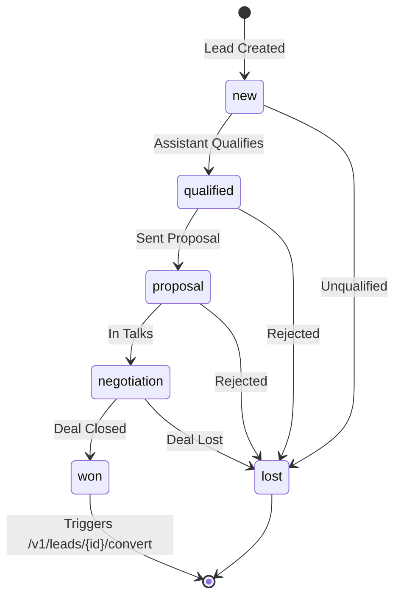
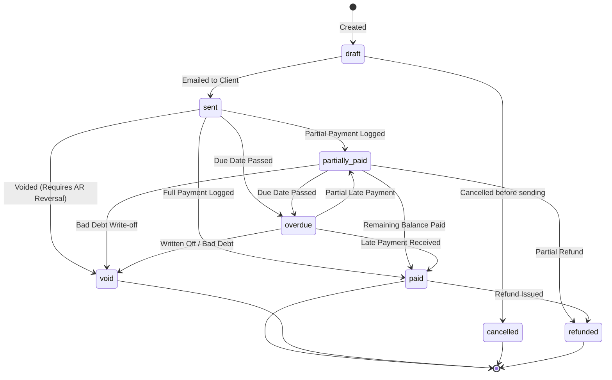
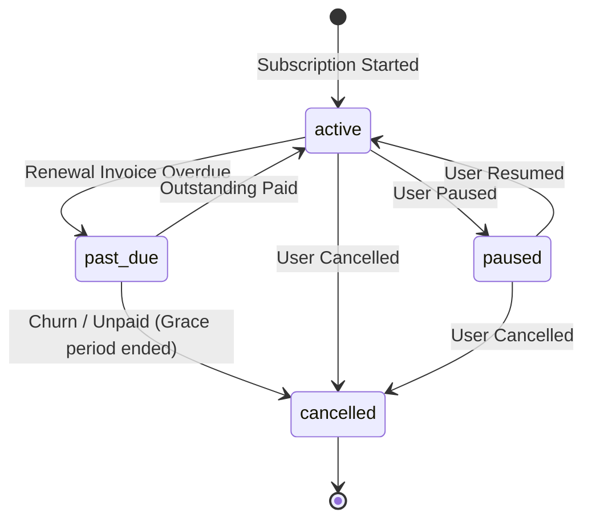
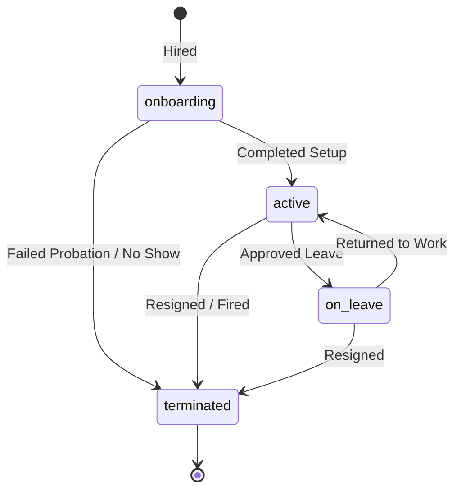

# ERP State Machines & Workflows

Because the Open API ERP is managed autonomously by CLI AI assistants, strict adherence to predefined state machines is required. Assistants must understand the legal transitions of an entity (e.g., an invoice cannot be `paid` if it is still a `draft`) to prevent data corruption.

This document maps out the core state machines and event workflows for the system.

## 1. CRM: Lead Lifecycle

Leads follow a strict sales funnel. Once a lead reaches the `won` state, the assistant triggers the conversion endpoint to promote the Lead to a Client.

## 2. Invoicing: Invoice Lifecycle

Invoices possess the most complex state machine, as their transitions directly impact the Accounting module (Accounts Receivable) and trigger automated background events.

## 3. Invoicing: Subscription Lifecycle

Subscriptions automate the generation of recurring invoices on specific billing intervals.

## 4. HR: Employee Lifecycle

Tracks the employment and payroll eligibility status of staff members.

## 5. Workflow: Asynchronous Event Processing

To maintain fast API responses and decouple modules, state transitions (like an Invoice being Paid) are processed via the Outbox pattern.

```mermaid
sequenceDiagram
    participant Assistant
    participant API
    participant Database
    participant EventBus
    participant BackgroundWorker
    
    Assistant->>API: POST /v1/invoices/123/pay (Payment Data)
    
    rect rgb(30, 30, 30)
        Note over API,Database: SQLite Transaction (WAL Mode)
        API->>Database: Update Invoice status to 'paid'
        API->>Database: Insert Payment record
        API->>Database: Insert 'invoice.paid' event (status='pending')
    end
    
    API-->>Assistant: 200 OK (Payment Recorded)
    
    loop Every 5 seconds
        BackgroundWorker->>Database: Poll for 'pending' events
        Database-->>BackgroundWorker: Return 'invoice.paid' event
        BackgroundWorker->>EventBus: Dispatch 'invoice.paid' handler
        EventBus->>BackgroundWorker: Execute Accounting Listener
        
        alt Success
            BackgroundWorker->>Database: Generate Journal Entry (Debit Cash, Credit AR)
            BackgroundWorker->>Database: Update event status='completed'
        else Failure (e.g. Period Locked)
            BackgroundWorker->>Database: Update event status='failed', error_message='Period Locked'
        end
    end
```

